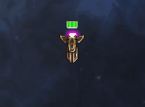
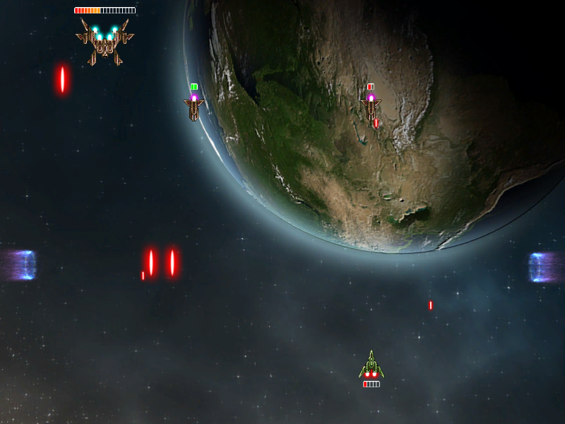
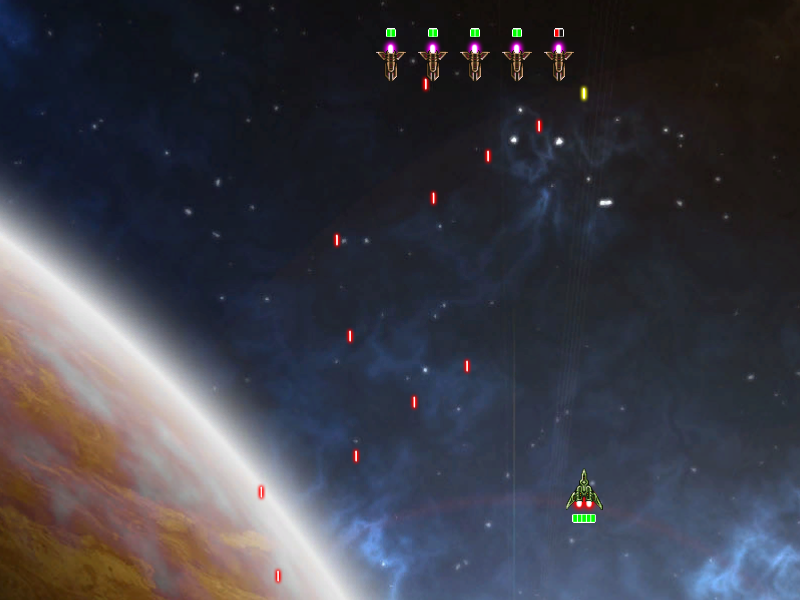

# Out of space Unity edition

The goal of this project is to learn Unity by remaking and improving an old game made by me and my friend using C++ and SFML library.

### The game can be played here:
https://pojemnik.itch.io/out-of-space

### Screenshots:

### Link to the original project:
https://github.com/IIaMoCLitTMW/OUT-OF-SPACE
